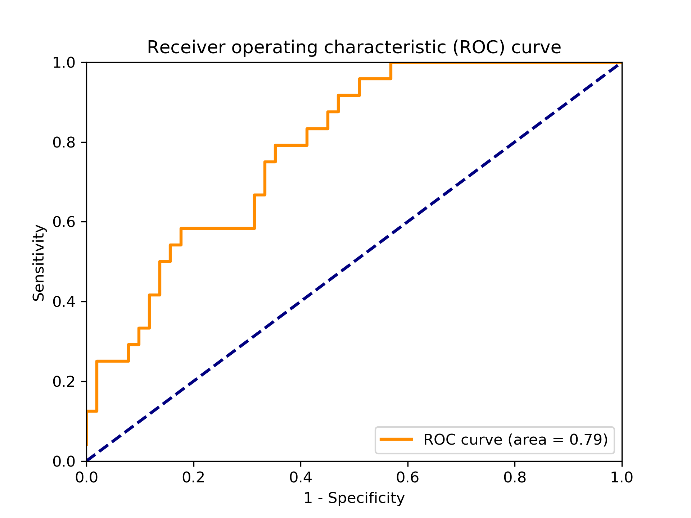

#  Challenge: Disease prediction from DNA data
## By Owkin-Inserm

The dataset was provided by [Owkin-Inserm](https://challengedata.ens.fr/en/challenge/40/disease_prediction_from_dna_data.html).

| Machine learning model  | Area under ROC curve | Rank |    Date    |
|-------------------------|:--------------------:|:----:|:----------:|
| SVM RBF Kernel          | 0.730327             |   8  | 27/01/2018 |
| SVM Linear Kernel       | 0.746186             |  10  | 30/01/2018 |
| MLP 512x512             | 0.725787             |   8  | 27/01/2018 |
| X Gradient boosted tree | 0.730905             |   8  | 27/01/2018 |



The training data set contained Ids for patients, a portion of their genotype as Single Nucleotide Polymorphisms (SNPs), and a binary label designating a pathological (1) or healthy (0) phenotype. As is conventional, the testing data did not contain this label. The score of the predictive model was calculated using an area under the curve (AUC) comparing with the true phenotype.

The binary classifier used was a degree 3 support vector machine (SVM), and can be run using the following line of code:

```bash
python3 svm.py > test_label.csv
```

Some simple visulizations of the dataset:

* [Training set SNPs](visuals/trainSNP.pdf "Training set SNPs")
* [Training set SNP features](visuals/trainFeatureSNP.pdf "Training set SNP features")
